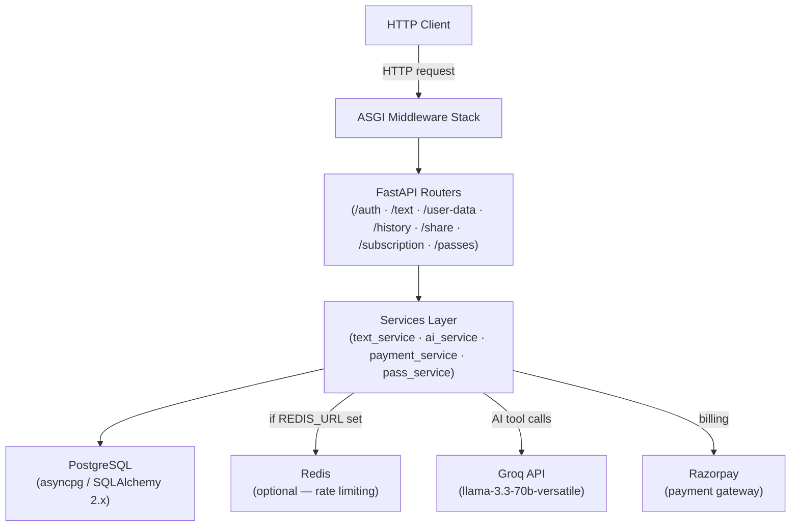

# Backend Architecture

> System overview of the FixMyText FastAPI backend.

## Layered Architecture



---

## Middleware Stack

FastAPI calls middleware in reverse registration order — the last `add_middleware()` call wraps outermost. The effective request-processing order is:

1. **CORSMiddleware** — validates `Origin` header against `CORS_ORIGINS`, sets `Access-Control-*` response headers.
2. **RequestLoggingMiddleware** — logs method, path, status code, latency, and the `X-Correlation-ID` set by the next layer.
3. **SecurityHeadersMiddleware** — injects `X-Content-Type-Options`, `X-Frame-Options`, `Referrer-Policy`, and `Content-Security-Policy` on every response.
4. **CorrelationIdMiddleware** — reads or generates a UUID `X-Correlation-ID` header and attaches it to the request state.

All four middleware classes are defined directly in `main.py`.

---

## Tool Dispatch Pattern

All text transformation tools — both local and AI — share a unified dispatch path.

### Tool Registry

`app/core/tool_registry.py` is the single source of truth. At import time, `_register_all_tools()` populates `_TOOL_REGISTRY` — a `dict[str, ToolDefinition]`. Each entry records:

- `id` — URL-safe slug (also the route path segment, e.g. `"uppercase"`)
- `handler` — sync callable from `text_service` for `LOCAL` tools; `None` for `AI` tools
- `tool_type` — `ToolType.LOCAL` or `ToolType.AI`
- `request_model` — name of the non-standard Pydantic schema if the tool needs extra fields (e.g. `"CaesarRequest"`); `None` defaults to `TextRequest`
- `requires_auth` — `True` for all AI tools

`app/api/v1/endpoints/text.py` reads this registry at startup and generates one `POST` route per tool via `_register_routes()`, so adding a new tool requires only a registry entry.

### Local Tool Call Flow

```
POST /api/v1/text/{slug}
  → _execute_tool() in text.py
    → _enforce_tool_access()  (trial / pass check → HTTP 429 if exhausted)
    → tool.handler(request.text, *extra_params)  (pure sync function in text_service)
    → record history (for authenticated users)
    → TextResponse { original, result, operation }
```

### AI Tool Call Flow

```
POST /api/v1/text/{slug}
  → _execute_tool() in text.py
    → _enforce_tool_access()
    → ai_limiter.check()       (per-user AI rate limit)
    → ai_service.run_ai_tool(tool_id, text, *extra_args)
        → looks up tool_id in _AI_HANDLERS dict
        → _ai_transform(): tries Groq first, falls back to local function
    → record history
    → TextResponse { original, result, operation }
```

The `_AI_HANDLERS` dict in `app/services/ai_service.py` maps each AI tool slug to a 4-tuple:

```python
_AI_HANDLERS = {
    # tool_id: (prompt_key, fallback_fn, extra_fallback_args, ai_kwargs)
    "summarize": ("summarize", _summarize_fallback, (), {"temperature": 0.5, "max_tokens": 500}),
    ...
}
```

`prompt_key` references a string in `PROMPTS` (from `app/services/ai_prompts.py`). `fallback_fn` is called when Groq is unavailable.

---

## Database Layer

| Item | Detail |
|------|--------|
| ORM | SQLAlchemy 2.x (async) |
| Driver | `asyncpg` |
| Migration tool | Alembic |
| Connection factory | `app/db/session.py` — `create_async_engine` |

Models are split across three PostgreSQL schemas:

| Schema | Tables |
|--------|--------|
| `auth` | `user`, `preferences`, `user_ui_settings` |
| `activity` | `operation_history`, `user_tool_stats`, `user_tool_usage`, `visitor_usage`, `visitor_tool_usage`, `user_daily_login`, `user_discovered_tool`, `user_favorite_tool`, `user_pipeline`, `gamification`, `shared_result`, `template`, `user_spin_log` |
| `billing` | `billing_catalog`, `billing_subscription`, `billing_credit`, `billing_pass` |

Schema names are configured via `DB_SCHEMA_AUTH`, `DB_SCHEMA_ACTIVITY`, and `DB_SCHEMA_BILLING` in `app/core/config.py` (defaults: `auth`, `activity`, `billing`).

---

## Redis Integration

Redis is **optional**. When `REDIS_URL` is set in the environment, `app/core/redis.py` opens an `asyncio`-backed connection pool at startup (FastAPI lifespan). When Redis is unavailable or `REDIS_URL` is empty, the application falls back to in-memory rate-limit counters that do not persist across restarts or scale across multiple workers.

Redis is used for:

- **Distributed rate limiting** — per-user and per-visitor daily tool counts
- **Auth cooldowns** — per-user throttle on password-reset and email-verification requests

---

## AI Service

| Item | Detail |
|------|--------|
| Provider | Groq API |
| Model | `llama-3.3-70b-versatile` (configurable via `GROQ_MODEL` in `app/core/config.py`) |
| Client | `AsyncGroq` — initialized once in FastAPI lifespan via `init_groq_client()` |
| Fallback | YAKE keyword extraction (`yake` library) for tools that have a meaningful offline fallback; `_ai_unavailable_fallback` raises HTTP 503 for tools that cannot degrade |
| Test seam | `AI_BACKEND=fake` in `.env` short-circuits all Groq calls with a deterministic stub response |
| Streaming | `stream_ai_tool()` yields token chunks via Server-Sent Events |

The `_AI_HANDLERS` registry (described above) drives all AI dispatch. Adding a new AI tool does not require a new service class — one dict entry and one prompt string are sufficient.

---

## Payments

Razorpay integration is encapsulated in two service files:

- `app/services/razorpay_service.py` — creates orders and fetches order details from the Razorpay REST API
- `app/services/payment_service.py` — verifies HMAC signatures and orchestrates the full payment confirmation flow

The billing endpoints in `app/api/v1/endpoints/subscription.py` and `passes.py` call `payment_service`. Credentials (`RAZORPAY_KEY_ID`, `RAZORPAY_KEY_SECRET`) come from environment variables — never hardcoded. Set `PAYMENTS_BACKEND=fake` to use an in-memory stub during E2E tests.

---

## Request Lifecycle

### Local tool call

1. Client sends `POST /api/v1/text/uppercase` with `{"text": "hello"}` and `Authorization: Bearer <token>` + `X-Visitor-Id` headers.
2. `CorrelationIdMiddleware` stamps the request with a UUID.
3. `CORSMiddleware` validates the origin.
4. `_execute_tool()` calls `_enforce_tool_access()` — checks daily usage against the user's tier or the visitor's fingerprint. Returns HTTP 429 if exhausted.
5. `tool.handler("hello")` runs `text_service.uppercase` synchronously.
6. History is recorded for authenticated users via `record_operation_history()`.
7. `TextResponse(original="hello", result="HELLO", operation="uppercase")` is returned.

### AI tool call

Steps 1-4 are the same. Then:

5. `ai_limiter.check()` enforces the per-user AI rate limit.
6. `ai_service.run_ai_tool("summarize", text)` looks up `_AI_HANDLERS["summarize"]`, builds the system prompt from `PROMPTS["summarize"]`, and calls `_ai_transform()`.
7. `_ai_transform()` attempts `_groq_chat()` with a 35-second timeout. On failure, falls back to `_summarize_fallback(text)`.
8. History is recorded. `TextResponse` is returned.
